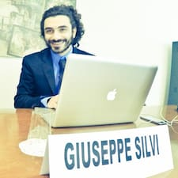

## About Giuseppe

> Vivere è stare svegli    
(A. M. Ripellino)

Giuseppe is a Musician, somewhere it means he is multiple things:

 - adjunct professor in **Electronic Music** at _Conservatorio di Musica S. Cecilia_ of Rome, IT.
 - adjunct professor in **Electronic Music** at _Conservatorio di Musica Nicolini_ of Piacenza, IT.
 - professor of **Music Technologies** at _Liceo Statale Satta_ of Nuoro, IT.

## Research Interest

His research on sound space and musical dimensions led him to the construction of electroacoustic prototypes and software for music production.

He is sound engineer specialised in surround recordings.

Sometimes he makes music with [@paxxxc](https://twitter.com/paxxxc) and works for the **CRM** - *Centro Ricerche Musicali* of Rome

He uses [GitHub](https://github.com/grammaton) to scratch ideas.

His research on sound space and musical dimensions led him to the construction of electroacoustic prototypes and software for music production.

<!-- ## Publications

1. F.Bar, J.Doe: Effects of having a placeholder of a name -->

## Activities

<ul class="post-list">
    
      <li>{{ post.date | date: "%b %-d, %Y" }} • <a class="post-link" href="{{ post.url | relative_url }}">{{ post.title | escape }}</a></li>
    
</ul>
<a href="{{ site.url}}/activities/">list of activities…</a>

## Blog

<ul class="post-list">
    
      <li>{{ post.date | date: "%b %-d, %Y" }} • <a class="post-link" href="{{ post.url | relative_url }}">{{ post.title | escape }}</a></li>
    
</ul>
<a href="{{ site.url}}/blog/">list of posts…</a>

<!-- ## Typography

This is a [link](http://google.com). Something *italics* and something **bold**.

Here is a table

Year | Award | Category
-----|-------|--------
2014 | Emmy  | Won Outstanding Lead Actor in a miniseries or a movie
2015 | BAFTA | Nominated for Best Leading Actor for Sherlock
2014 | Satellite | Won Best Actor miniseries or television film

Here is a horizontal rule

---

Here is a blockquote

> To a great mind, nothing is little

## References

* Foo Bar: Head of Department, Placeholder Names, Lorem
* John Doe: Associate Professor, Department of Computer Science, Ipsum -->
